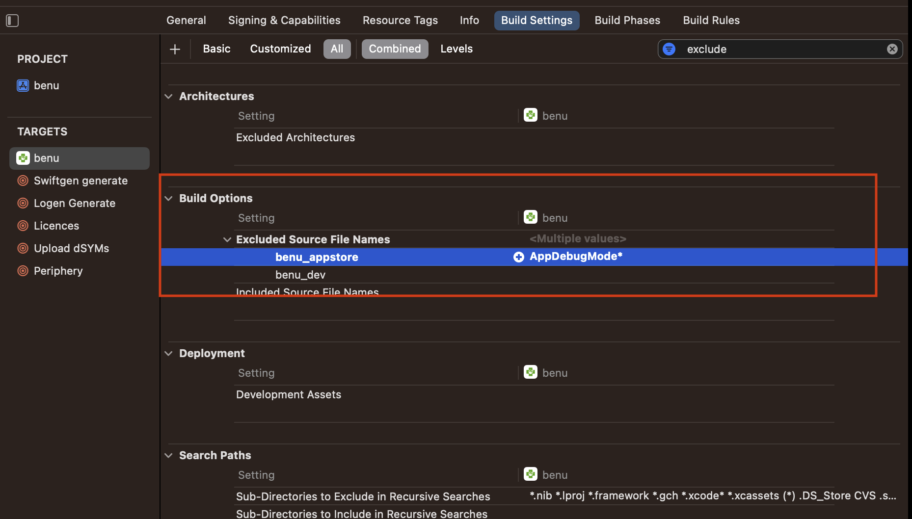
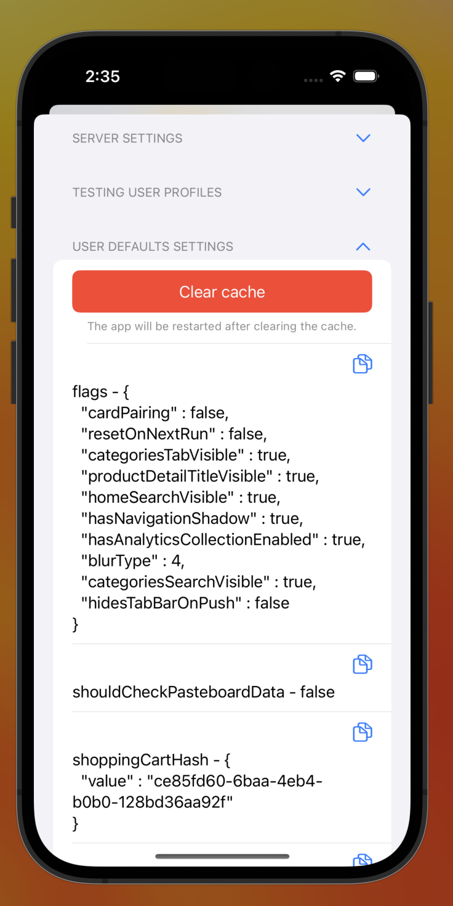
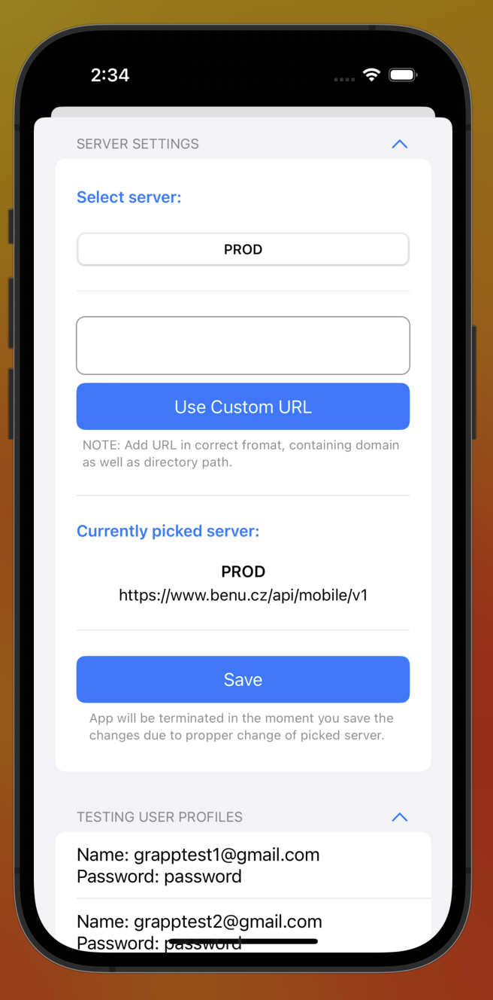

# AppDebugMode

Swift Package ***AppDebugMode*** is a library that allows an iOS application to select an API Server and User for the app during runtime. This can be helpful during development and testing phases of the application. With ***AppDebugMode***, developers and testers can easily switch between development, staging, and production environments without recompiling the application. Additionally, it allows developers and testers to select different users test different scenarios in the app.

## Instalation

### 1. Add Swift Package
```swift
/// Package.swift
dependencies: [
    .package(url: "git@github.com:GoodRequest/AppDebugMode-iOS.git", .upToNextMajor(from: "1.2.0"))
]
```

### 2. Exclude AppDebugMode package from Release sceheme



## Setup 
```swift
/// AppDelegate.swift
#if DEBUG
import AppDebugMode
#endif

#if DEBUG
    enum ServersCollections {

        static let myAppBackend = ApiServerCollection(
            name: "My App backend",
            servers: [
                Servers.prod,
                Servers.dev
            ],
            defaultSelectedServer: Servers.dev
        )

        static var allCases: [ApiServerCollection] = [
            Self.myAppBackend
        ]

    }

    enum Servers {
        
        static let prod = ApiServer(name: "PROD", url: "https://api.production.example")
        static let dev = ApiServer(name: "DEV", url: "https://test.api")
        
    }
#endif

// `didFinishLaunchingWithOptions` (before starting coordinator):
#if DEBUG
    AppDebugModeProvider.shared.setup(
        serversCollections: ServersCollections.allCases,
        onServerChange: { 
            // logout user
        }
    )
#endif
```

## Get selected server

```swift
#if DEBUG
import AppDebugMode
#endif

var baseURL: String {
    #if DEBUG
    return AppDebugModeProvider.shared.getSelectedServer(for: ServersCollections.myAppBackend).url
    #else
    return "https://api.production.example"
    #endif
}
```

## Get selected user

```swift
#if DEBUG
import AppDebugMode
#endif

#if DEBUG
    AppDebugModeProvider.shared.selectedTestingUserPublisher
        .sink { [weak self] in
            self?.emailTextField.text = $0?.name
            self?.passwordTextField.text = $0?.password
        }
        .store(in: &cancellables)
#endif
```

## Cache setup
> **Warning:** To ensure the proper functioning of the cache manager, you need to utilize the [GoodPersistence](https://github.com/GoodRequest/GoodPersistence) properties in your cache manager.

```swift
/// AppDelegate.swift
#if DEBUG
    AppDebugModeProvider.shared.setup(
        serversCollections: ServersCollections.allCases,
        onServerChange: { 
            // logout user
        },
        cacheManager: // optional - provide your own cache manager
    )
#endif
```



## Push notifications
If you want to use push notifications in debug mode, you need to pass `Messaging.Messaging()` object into `AppDebugModeProvider.shared.setup()` method.

```swift
// didFinishLaunchingWithOptions

// essential configuration
FirebaseConfiguration.shared.setLoggerLevel(.min)
FirebaseApp.configure()

#if DEBUG
AppDebugModeProvider.shared.setup(
    serversCollections: C.ServersCollections.allCases,
    onServerChange: { },
    cacheManager: dependencyContainer.cacheManager,
    firebaseMessaging: Messaging.messaging() // Firebase messaging object
)
#endif
```


## Activation in App
- In app you can activate debug mode by shaking device or in simulator by `CMD + CTRL + Z`
- To open debug mode with other actions in the app initialize ViewController with `let debugViewController = AppDebugModeProvider.shared.start()`


